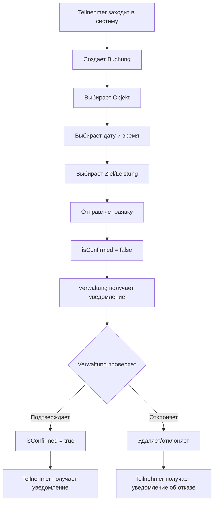
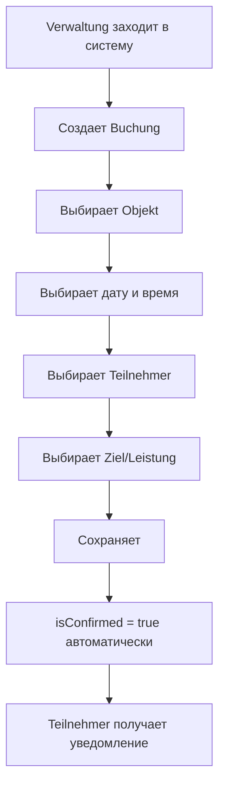

# Sport Booking System - Система бронирования спортивных объектов

**Created:** 2025-03-22
**Status:** In Development
**User Status:** `7` (Sport- und Bäderamt)

## 📋 Обзор задачи

Адаптация существующего функционала управления терминами для задачи бронирования спортивных объектов управлением спорта и бассейнов города Бонн.

## 🎯 Цель

Создать систему бронирования времени использования ~40 спортивных объектов с:
- Возможностью самостоятельного бронирования участниками (Teilnehmer)
- Обязательным подтверждением директором (status=7)
- Отчетностью по объектам и использованию
- Кастомной терминологией только для пользователей со status=7

---

## 🔄 Адаптация существующего функционала

### Mapping сущностей

| Старое название | Новое название для status=7 | Сущность БД | Описание |
|----------------|----------------------------|-------------|----------|
| **Termine** | **Buchungen** | `appointments` | Бронирования времени на объектах |
| **Kunden** | **Objekte** / **Sportanlagen** | `clients` | ~40 спортивных объектов с адресами |
| **Mitarbeiter** | **Teilnehmer** | `workers` | Участники (спортивные организации, клубы) |
| **Dienstleistungen** | **Ziel** / **Leistung** | `services` | Цель использования (футбол, хоккей на траве, etc.) |
| **Direktor** | **Verwaltung** | `users.status=7` | Управление спорта |

---

## 👥 Роли и права доступа

### 1. Verwaltung (Управление спорта) - `user.status = 7`

**Права:**
- ✅ Просмотр всех бронирований (Buchungen)
- ✅ Подтверждение/отклонение заявок от Teilnehmer
- ✅ Создание бронирований вручную
- ✅ Редактирование бронирований
- ✅ Удаление бронирований
- ✅ Просмотр отчетов по объектам
- ✅ Управление Teilnehmer (участниками)
- ✅ Управление Objekte (спортивными объектами)

### 2. Teilnehmer (Участники) - `user.status = 8` (worker)

**Права:**
- ✅ Создание заявок на бронирование (Buchungen)
- ✅ Просмотр только своих бронирований
- ❌ Редактирование после подтверждения
- ❌ Просмотр чужих бронирований
- ❌ Просмотр отчетов

**Важное отличие от родительской программы:**
- ⚠️ Teilnehmer **САМ создает** Buchungen (в отличие от обычных workers со status=1)
- ⚠️ Buchungen требует **обязательного подтверждения** от Verwaltung (status=7)
- ⚠️ Используем **status=8**, чтобы не смешивать с обычными workers (status=1) родительского проекта

---

## 📊 Структура данных

### Buchungen (appointments)

```typescript
interface Buchung {
  id: string
  date: Date                    // Дата бронирования
  startTime?: Date              // Время начала (опционально)
  endTime?: Date                // Время окончания (опционально)
  duration: number              // Длительность в минутах

  // Связи
  clientID: string              // Objekt (спортивный объект)
  worker: Worker[]              // Teilnehmer (участники)
  services: Service[]           // Ziel/Leistung (цель использования)

  // Статус подтверждения (НОВОЕ ПОЛЕ!)
  isConfirmed: boolean          // Подтверждено управлением?
  confirmedBy?: string          // userID, кто подтвердил
  confirmedAt?: Date            // Когда подтверждено

  // Существующие поля
  firmaID: string               // Organisation (Sport- und Bäderamt)
  isOpen: boolean
  createdAt: Date
  editedAt?: Date
}
```

**⚠️ Требуется добавить новые поля в таблицу `appointments`:**
- `isConfirmed` - BOOLEAN (default: false для status=7)
- `confirmedBy` - VARCHAR(21) (userID)
- `confirmedAt` - TIMESTAMP

### Objekte (clients)

```typescript
interface Objekt {
  clientID: string
  name: string                  // Название объекта
  address: string               // Адрес
  latitude?: number
  longitude?: number
  firmaID: string               // Sport- und Bäderamt
}
```

**Примеры объектов:**
- Stadion Hardtberg
- Schwimmbad Beuel
- Sporthalle Nord
- Tennisplatz Süd
- etc. (всего ~40 объектов)

### Teilnehmer (workers)

```typescript
interface Teilnehmer {
  workerID: string
  name: string                  // Название организации/клуба
  email?: string
  phone?: string
  userID?: string               // Связь с users (для входа в систему)
  firmaID: string               // Sport- und Bäderamt
}
```

**Примеры участников:**
- FC Bonn (футбольный клуб)
- Schwimmverein Bonn (плавательный клуб)
- Tennisclub Rot-Weiß
- etc.

### Ziel/Leistung (services)

Многоуровневый справочник целей использования:

```
📁 Stadion
  ├─ ⚽ Fußball
  ├─ 🏑 Hockey auf Rasen
  └─ 🏃 Leichtathletik

📁 Schwimmbad
  ├─ 🏊 Schwimmtraining
  ├─ 🤽 Wasserball
  └─ 🏊 Aquafitness

📁 Sporthalle
  ├─ 🏀 Basketball
  ├─ 🏐 Volleyball
  └─ 🤸 Turnen
```

---

## 🔄 Workflow бронирования

### Сценарий 1: Teilnehmer создает бронирование



### Сценарий 2: Verwaltung создает бронирование



---

## 📈 Отчеты по объектам

### Структура отчета

**Группировка:** По объектам (Objekt/Sportanlage)

| № | Objekt | Datum | Teilnehmer | Ziel/Leistung | Zeit | Status |
|---|--------|-------|------------|---------------|------|--------|
| 1 | Stadion Hardtberg | 22.03.2025 | FC Bonn | Fußball - Training | 18:00-20:00 | ✅ Bestätigt |
| 2 | Stadion Hardtberg | 23.03.2025 | Hockey Club | Hockey auf Rasen | 16:00-18:00 | ⏳ Ausstehend |
| 3 | Schwimmbad Beuel | 22.03.2025 | Schwimmverein | Schwimmtraining | 19:00-21:00 | ✅ Bestätigt |

**Фильтры:**
- 📅 Zeitraum (период времени)
- 🏢 Objekt (объект)
- 👥 Teilnehmer (участник)
- 🎯 Ziel/Leistung (цель)
- ✅ Status (подтверждено/не подтверждено)

**Экспорт:**
- 📄 PDF
- 📊 Excel/CSV
- 📧 Email

---

## 🎨 UI Изменения для status=7

### Навигация

**Было (для обычных пользователей):**
- 📅 Dienstplan (Расписание)
- 👥 Kunden (Клиенты)
- 💼 Mitarbeiter (Сотрудники)
- 🛠️ Dienstleistungen (Услуги)

**Стало (для status=7):**
- 📅 Buchungen (Бронирования)
- 🏢 Objekte / Sportanlagen (Объекты)
- 👥 Teilnehmer (Участники)
- 🎯 Ziele / Leistungen (Цели использования)
- 📊 Berichte (Отчеты) - **НОВЫЙ РАЗДЕЛ**

### Карточка бронирования (Buchung)

```
┌─────────────────────────────────────────┐
│  Buchung bearbeiten                     │
├─────────────────────────────────────────┤
│                                         │
│  Objekt: [Stadion Hardtberg ▼]         │
│  Datum:  [22.03.2025]                   │
│  Zeit:   [18:00] bis [20:00]            │
│                                         │
│  Teilnehmer: [FC Bonn ▼]                │
│  Ziel: [Fußball - Training ▼]           │
│                                         │
│  Status: ⏳ Ausstehend                   │
│                                         │
│  [✅ Bestätigen] [❌ Ablehnen]          │
│                                         │
└─────────────────────────────────────────┘
```

---

## 🔧 Технические изменения

### 1. База данных

**Добавить в таблицу `appointments`:**
```sql
ALTER TABLE appointments
ADD COLUMN "isConfirmed" BOOLEAN DEFAULT false,
ADD COLUMN "confirmedBy" VARCHAR(21) REFERENCES users("userID"),
ADD COLUMN "confirmedAt" TIMESTAMP WITH TIME ZONE;

-- Для существующих записей (не status=7)
UPDATE appointments
SET "isConfirmed" = true
WHERE "firmaID" NOT IN (
  SELECT "firmaID" FROM users WHERE status = 7
);
```

### 2. API изменения

**POST /api/scheduling/appointments**
- Для status=7: `isConfirmed = false` (требует подтверждения)
- Для остальных: `isConfirmed = true` (автоматически)
- Если создает Verwaltung (status=7): `isConfirmed = true`
- Если создает Teilnehmer (status=8): `isConfirmed = false`

**PATCH /api/scheduling/appointments/:id/confirm**
- Новый endpoint для подтверждения бронирования
- Доступен только для status=7
- Устанавливает `isConfirmed = true`, `confirmedBy`, `confirmedAt`

**GET /api/scheduling/reports/objects**
- Новый endpoint для отчетов по объектам
- Доступен только для status=7
- Группировка по объектам
- Фильтры по дате, объекту, участнику, цели

### 3. Переводы (i18n)

**Новый файл:** `dictionaries/status7-de.json`

```json
{
  "appointments": "Buchungen",
  "appointment": "Buchung",
  "clients": "Objekte",
  "client": "Objekt",
  "sportFacility": "Sportanlage",
  "workers": "Teilnehmer",
  "worker": "Teilnehmer",
  "services": "Ziele",
  "service": "Ziel",
  "leistung": "Leistung",
  "management": "Verwaltung",
  "reports": "Berichte",
  "confirm": "Bestätigen",
  "reject": "Ablehnen",
  "pending": "Ausstehend",
  "confirmed": "Bestätigt"
}
```

### 4. Компоненты

**Новые компоненты:**
- `components/sport/BookingCard.tsx` - Карточка бронирования с кнопками подтверждения
- `components/sport/ObjectsReport.tsx` - Отчет по объектам
- `components/sport/ConfirmationDialog.tsx` - Диалог подтверждения/отклонения
- `app/[lang]/reports/page.tsx` - Страница отчетов (только для status=7)

**Модифицированные компоненты:**
- `components/scheduling/DienstplanView.tsx` - Условный рендеринг названий
- `components/scheduling/AppModal.tsx` - Добавить поля подтверждения
- `components/scheduling/AppView.tsx` - Условные названия

---

## 🚀 План реализации

### Phase 1: База данных и API (1-2 дня)
- [ ] Добавить поля `isConfirmed`, `confirmedBy`, `confirmedAt` в таблицу `appointments`
- [ ] Обновить API для работы с подтверждениями
- [ ] Создать endpoint для подтверждения/отклонения
- [ ] Создать endpoint для отчетов

### Phase 2: UI и переводы (2-3 дня)
- [ ] Создать словарь переводов для status=7
- [ ] Добавить условную логику отображения названий
- [ ] Создать компонент карточки бронирования с подтверждением
- [ ] Обновить навигацию для status=7

### Phase 3: Отчеты (2-3 дня)
- [ ] Создать страницу отчетов
- [ ] Реализовать фильтрацию и группировку
- [ ] Добавить экспорт в PDF/Excel
- [ ] Добавить визуализацию (графики использования)

### Phase 4: Тестирование (1-2 дня)
- [ ] Создать тестовые объекты
- [ ] Создать тестовых участников
- [ ] Протестировать workflow бронирования
- [ ] Протестировать отчеты

---

## 📝 Примечания

### Связь с родительской программой

Этот функционал является **промежуточным этапом** для реализации полноценной системы отчетов в основной программе управления услугами.

**Что переиспользуем:**
- ✅ Структура отчетов по объектам
- ✅ Логика группировки и фильтрации
- ✅ Экспорт в PDF/Excel
- ✅ Система подтверждений (можно адаптировать для других сценариев)

**Что уникально для sport booking:**
- Терминология (Buchungen, Objekte, Teilnehmer)
- Workflow с обязательным подтверждением
- Специфичные отчеты для спортивных объектов

### Масштабируемость

Система спроектирована так, чтобы в будущем добавить:
- 🔄 Повторяющиеся бронирования (регулярные тренировки)
- 📧 Email уведомления участникам
- 📱 Mobile app для Teilnehmer
- 💰 Ценообразование и биллинг
- 📊 Аналитика загрузки объектов
- 🗓️ Календарный вид с drag-n-drop

---

## 🎯 Success Criteria

Система считается успешно реализованной, если:

1. ✅ Пользователь со status=7 видит кастомные названия
2. ✅ Teilnehmer может создавать бронирования
3. ✅ Verwaltung может подтверждать/отклонять заявки
4. ✅ Отчет по объектам работает с группировкой и фильтрами
5. ✅ Экспорт отчетов в PDF/Excel
6. ✅ Обычные пользователи (status ≠ 7) не видят изменений
7. ✅ Все существующие тесты проходят

---

**Документ поддерживается и обновляется по мере реализации.**
